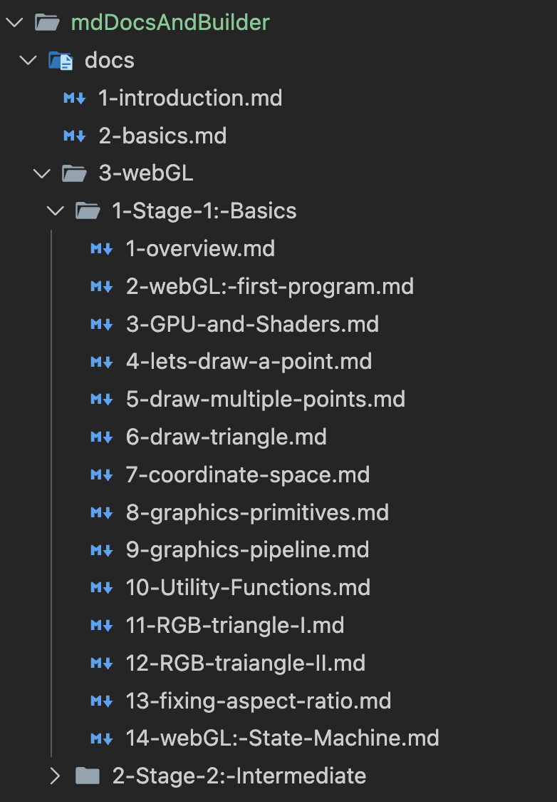
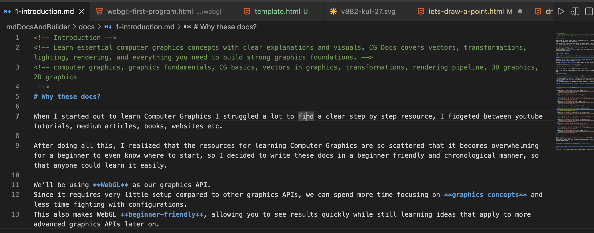

# Computer Graphics Docs (Cg-docs)

Computer Graphics can often feel difficult, not because it's inherently complex, but because learning resources are scattered and lack a clear, step-by-step progression.

This documentation project is my attempt to fix that. The goal is simple: **to make Computer Graphics easier to understand and more approachable for everyone** by organizing all concepts sequentially—from fundamentals to advanced ideas—allowing learners to build a solid mental model without constantly jumping between sources.

---

## How to Contribute

We welcome contributions! Whether you're fixing a typo, clarifying a concept, or adding an entirely new chapter, your help is valuable.

Follow these steps to contribute:

1.  **Fork** the repository on GitHub.
2.  **Clone** your forked repository to your local machine.
3.  Create a new branch for your changes:
    ```bash
    git checkout -b feature/your-topic-name
    ```
4.  Make your changes in the appropriate folder (see the workflow section below).
5.  **Commit** your changes with a descriptive message.
6.  **Push** your branch to your forked repository.
7.  Open a **Pull Request** from your branch to the main repository.

---

## Project Structure & Workflow

The repository is organized into three main folders. You will primarily work inside the `mdDocsAndBuilder` folder.

### 1. `mdDocsAndBuilder` (Source & Build Script)

This is the core folder containing the source files and the script that builds the documentation website.

| Folder | Purpose |
| :--- | :--- |
| **`docs/`** | **This is where you write the articles.** It contains Markdown (`.md`) files that are automatically converted into HTML pages for the website. **(Your primary focus)** |
| **`helpers/`** | Contains the functions that handle the conversion of Markdown to HTML. You typically **won't need to modify** this folder. |

#### Key Rules for Structure and Ordering:

1.  **Folders Become Sections:** Each folder within the `docs/` directory will automatically become a **dropdown section** (or chapter group) in the final navigation structure.
2.  **Prefixes Determine Order:** The organization, navigation, and chapter sequence are strictly determined by the numerical prefixes added to all files and folders.
    * *Example:* `01-Fundamentals/` precedes `02-Rendering/`, and `01-Introduction.md` precedes `02-CoordinateSystems.md`.

        * 
3.  **Mandatory SEO Metadata (HTML Comments):** Every new chapter or article must begin with three specific HTML comments at the very top for SEO purposes. These comments must be in the following order:
    * **First Comment:** The page title/name.
    * **Second Comment:** A brief description of the content.
    * **Third Comment:** Comma-separated keywords.

    * *Example Structure:*
        * 


#### Local Development Setup (Recommended):

Before starting to write, set up the real-time syncing so you can preview your changes instantly:

1.  Open your terminal and navigate into the builder directory:
    ```bash
    cd mdDocsAndBuilder
    ```
2.  Run the watch command. This will automatically convert and sync your Markdown files into the `cg-docs` folder whenever you save:
    ```bash
    npm run watch
    ```

### 2. `cg-docs` (The Output Website)

This folder contains the ready-to-distribute HTML files generated by the builder script from the Markdown source.

* **Important:** **Do not directly edit files in this folder.** They are automatically generated and any manual changes will be overwritten.

### 3. `drawings` (Diagrams Source)

This folder contains the source files for all diagrams and visuals used throughout the documentation.

* It holds the **Excalidraw files** (or similar source files) used as a backup.
* Screenshots (images) used in the documents should be sourced from these files.

---

## Get Started

Thank you for considering contributing to Cg-docs! We hope this resource makes learning Computer Graphics easier for everyone.

If you have any questions, feel free to open an issue on the repository. Happy documenting!